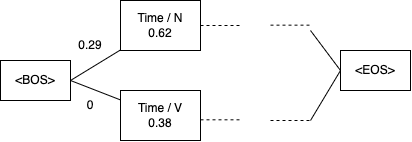

# Introduction

This repository is to tag part-of-speech (POS) with viterbi-algorithm. This tagging model considers two probability: 

(i) Probability of the part of speech a word can take  
(ii) Probability of POS bi-grams

with these probability, the program constructs lattice (like below image), then POS sequence can be predicted by viterbi-algorithm.



# Data Download
```bash
wget https://github.com/neubig/nlptutorial/raw/master/data/wiki-en-train.norm_pos
wget https://github.com/neubig/nlptutorial/raw/master/data/wiki-en-test.norm_pos
```

# Usage
```bash
python calc_prob.py --input wiki-en-train.norm_pos
python evaluate.py --input wiki-en-test.norm_pos 
```

# Accuracy

0.834319526627219

Note: The program doesn't work in the line 1, 3, 11, 51, 77, 93, 106, 141, 156 sentences. These sentences were treated that all prediction is incorrect. It is not known why the program does not work with these sentences.

# What does the program do

- `calc_prob.py`

  Caluclate the probabilities. These probability are outputted into `bi_pos.tsv` and `word_pos.tsv`. These correspondings (i) and (ii) in the Introduction section.

- `evaluate.py`

  Prediction the POS tag of test data and evaluate (calculate accuracy).